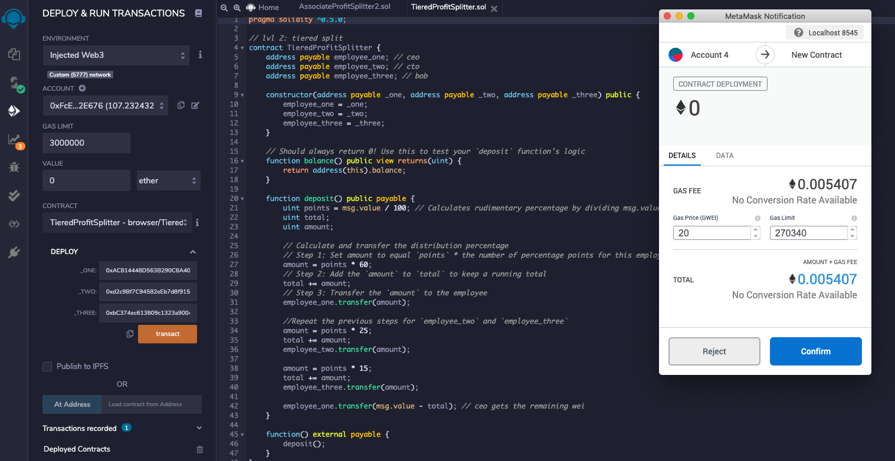

# Introduction to Smart Contracts using Solidity

## 1. Overview
The purpose of this exercise is and introduction to programming smart contracts with Solidity, by building 3 profit splitter contracts. These contracts will do several things:
 * Pay employees quickly and easily (Level 1)
 * Distribute profits to different tiers of employees (Level 2)
 * Distribute company shares for employees in a "deferred equity incentive plan" automatically (Level 3).

The following tools are used to build the Solidity contracts:
 * Ganache - Ganache is a personal blockchain for rapid Ethereum distributed application development. 
 * Remix IDE - Remix is a powerful, open source tool that helps you write Solidity contracts straight from the 
   browser
 * Metamask - MetaMask is a Google Chrome extension for the browser which makes it easy for web applications to 
   communicate with the Ethereum blockchain. 

 

## 2. Level 1: `AssociateProfitSplitter` Contract
This contract will accept ether into the contract, and divide it evenly among associate-level employees. This will allow the human resources department to pay employees quickly and efficiently.

The following is a summary of steps in the contract:
   * Defined public variables 
   * Created a constructor
   * Created 3 functions:  
        a. Balance function which returns the contract's current balance, which should always be '0'  

        b. Deposit function must ensure only the owner can call the function and that any remainder after division of the deposited amount, needs to be sent back to the owner,  

        c. Fallback function which ensures that the logic in the deposit function is executed if ether is sent directly to the contract, which prevents Ether being locked in the contract.  

### 2.1 Images of code and steps performed:

Code in Solidity for AssociateProfitSplitter:  

Deploy code in Remix with 0 Ether, for which there is a fee charged to the account:

Test functionality by transfering 45ETH

Ganache screenshots before and after showing the 15ETH increase in 3 accounts:

|||
|:---:|:---:|
| Account Value Pre-AssociateProfitSplitter | Account Value Post-AssociateProfitSplitter |

## 3. Level 2: `TieredProfitSplitter` Contract
This contract will distribute different percentages of incoming ether to employees at different tiers/levels. For example, the CEO gets paid 60%, CTO 25%, and Bob gets 15%.

The following is a summary of steps modified in the contract:
   * Deposit function: Calculating the points per employee representing a percentage which will be used to calculate the amount to be sent to each employee, with the remainder being sent to the employee with the highest percentage. 

### 3.1 Images of code and steps performed:

Code in Solidity for TieredProfitSplitter:  
 

Compile and deploy code with 0ETH, with fee charged:  

Deposit 30ETH, which is allocated as per percentages:  

Ganache screenshots before and after showing the 30ETH divided into 3 accounts with starting balance 110.67ETH increasing with 18ETH, 7.5ETH and 4.5ETH respectively:

|||
|:---:|:---:|
| Account Value Pre-TieredProfitSplitter | Account Value Post-TieredProfitSplitter |
 

## 4. Level 3: `DeferredEquityPlan` Contract
This contract will be managing an employee's "deferred equity incentive plan," in which 1000 shares will be distributed over four years to the employee. There is no need to work with ether in this contract, but amounts will be stored that represent the number of distributed shares the employee owns, and enforcing the vetting periods automatically.

The following is a summary of steps modified in the contract:
   * Set human resources in constructor as they will deploy the contract
   * Total shares of 1000 allocated per employee, payable over 4 years, 250 per year
   * Set start_time as Now
   * Create distribute function which distributes shares if a year has passed and ensures maximum of 1000 is allocated over 4 years

### 4.1 Deploy and test code locally using Fakenow function:
For purposes of testing locally a test file was created, DeferredEquityPlan_test.sol in which a new variable was added 'fakenow'. Fakenow is used in conjunction with a Fastforward function, that adds 100 days to the contract period. By fastforwarding 4 times, one can then distribute and test the code.

Images of steps performed for testing locally:

Deploy code in local test environment:  

Once the code is deployed, you use the "fastforward" function to bypass the test for a payment per year by fast fowarding 4 times. Once that is done, you are able to 'distribute' the shares. This is captured in below  screenshots with the last one showing the distributed_share of 250 for 1 year.

## 5. Deploy all contracts to live Testnet Kovan:
Point Metamask to Kovan network, ensure there is Ether on this network and deploy contracts to the live testnet. 1 Ether was transfered on 2 occations to the account to which the contracts was deployed:

### 5.1 Transfer 1.8ETH to account where contracts are being deployed, the confirmation and transaction:
  
  
  
  

### 5.2 Images of AssociateProfitSplitter deployed in Kovan:
1. Contract Deployment:  

2. Deposit of 1ETH, split equally between 3 accounts:  
  

3. Balances before and after deposit of 1ETH in AssociateProfitSplitter contract - images taken from MyCrypto in Kovan environment: 

|||
|:---:|:---:|
| Account Value Pre-AssociateProfitSplitter | Account Value Post-AssociateProfitSplitter |
 

### 5.3 Images of TieredProfitSplitter deployed in Kovan:
1. Contract Deployment:  

2. Deposit 1ETH, which is divided porpotionally into 3 accounts:  

3. Balances before and after deposit of 1ETH:  

|||
|:---:|:---:|
| Account Value Pre-TieredProfitSplitter | Account Value Post-TieredProfitSplitter |
 

### 5.4 Images of DeferredEquityPlan deployed in Kovan testnet:
1. Contract Deployment:  

2. Distrubute shares with 0ETH value:
In live test environment we did not use the Fakenow function, thus the distribution failed due to the fact that 1 year has not passed.  

  

### 5.6 Accounts used for Kovan testnet:

Account where varius contracts are deployed:
0xAC814448D563B290C8A40c4c076307A034cC17b9  

Accounts used on Kovan testnet to deposit employee equity (AssociateProfitSplitter and TieredProfitSplitter):  
   * Employee1 - 0x81080EB0235f9B0CB20ECf562e9b674d323E64D3  
   * Employee2 - 0xa208A69C53c1CFdDb514e0bAa5D44eF5E473653F  
   * Employee3 - 0x1AD1a5a270D5870a5D66720be00DDE26D6Bc4994  

## 6. File Location:
Starter code:
Level 1 Associate Profit Splitter: [APS_starter_code](./Solidity_code/AssociateProfitSplitter2.sol)

Level 2 Tiered Profit Splitter: [TPS_starter_code](./Solidity_code/TieredProfitSplitter.sol)

Level 3 Deferred Equity Plan Test Local: [DPStest_starter_code](./Solidity_code/DeferredEquityPlan_test.sol)

Level 4 Deferred Equity Plan Kovan Testnet: [DPSKovan_starter_code](./Solidity_code/DeferredEquityPlan.sol)

